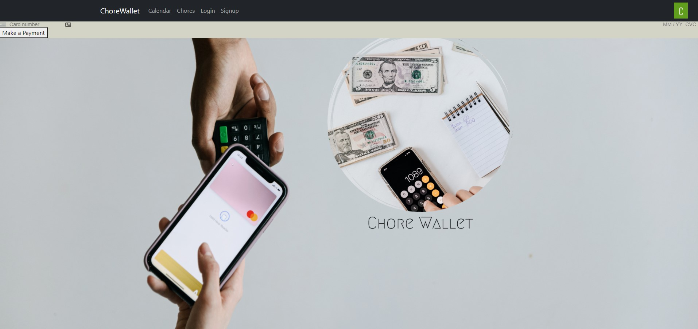
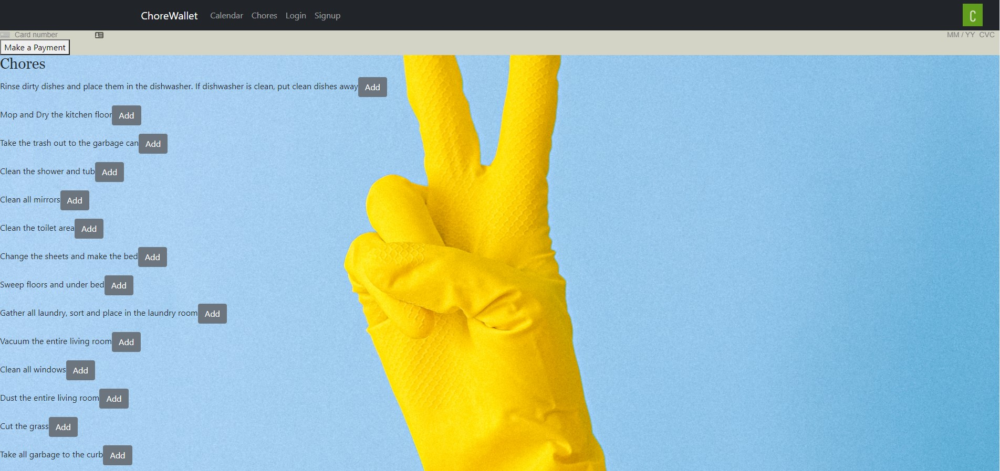

# 
  # **ChoreWallet**

  

  

  

  ## Description

  ## Welcome to ChoreWallet! An application built to help parents track chores that need to be completed as well as pay out allowances for completed chores. Parents can sign up with an email and password and assign to their children any of our various chores listed on the website. After completion of an assigned chore by the deadline, the child can select "Done" on that chore to receive payment electronically.

  ## Table of Contents        
   * [Installation](#Installation)
   * [Usage](#Usage)       
   * [Credits](#Credits)       
   * [License](#License)   
       
   ## Installation

    After cloning the repo, enter npm i in both client and server and download all dependicies listed in the package.json
    Enter npm run seed to add the seeded chore data.
    Finally, use npm run develop to run the application.

   ## Usage

    Used to track and pay chores and their completion status 

   ## Credits

    Hunter Johnson, Charity Rogers, William Takes and Baron Cannon       

   ## License

    This application is covered under MIT       

   ## Badges

         
 
   ## Features

           

   ## Contributing

    Links to contributors github: 
    
    Baron Cannon: http://github.com/BCannon88
    
    Hunter Johnson: https://github.com/Trayehunter1
    
    Charity Rogers: http://github.com/rogerscl116
    
    William Takes: https://github.com/Takes101

   ## Test

        
    

